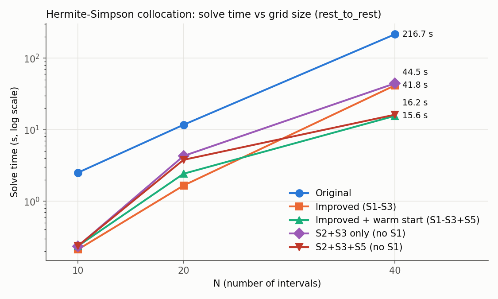
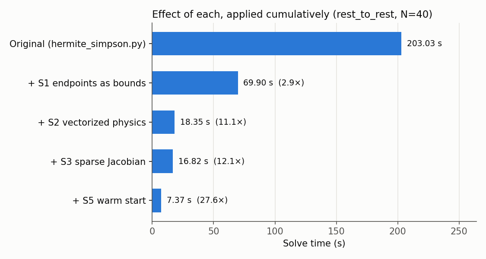

# Original vs Improved Hermite-Simpson Collocation

Generated by `experiments/compare_hermite_simpson.py`.

- **Speedup** = original time / this time (same N, same scenario).
- **Cost diff vs original** = |cost − original cost| / original cost. Near 0 means the same answer.
- **Max violation** = worst start/end/defect error (same definition for both solvers).
- **Final drift** = end-effector miss distance when the torques are replayed in a
  high-accuracy simulation (the benchmark's reality check).
- Times are the median of 1 run(s); the original solver at N ≥ 40 was timed once.
- Warm-start times **include** the coarse-grid solves; its iterations are the total over all levels.
- Unlike the Trapezoidal comparison, there is no S4 (scaling) row here yet;
  S1, S2, S3 and S5 (warm start) are ported over, S4 is left as future work.

## 1. Speed vs grid size (rest_to_rest)

| N | Solver | OK | Time | Speedup | Iterations | Cost | Cost diff vs original | Max violation | Final drift |
|---|---|---|---|---|---|---|---|---|---|
| 10 | Original | ✅ | 2.51 s | 1.0× | 54 | 214.597 | — | 3.6e-09 | 1.4083 m |
| 10 | Improved (S1-S3) | ✅ | 0.21 s | **11.9×** | 54 | 214.597 | 1.3e-10 | 4.4e-09 | 1.4083 m |
| 10 | Improved + warm start (S1-S3+S5) | ✅ | 0.24 s | **10.6×** | 54 | 214.597 | 1.3e-10 | 4.4e-09 | 1.4083 m |
| 10 | S2+S3 only (no S1) | ✅ | 0.24 s | **10.7×** | 54 | 214.597 | 1.4e-10 | 4.4e-09 | 1.4083 m |
| 10 | S2+S3+S5 (no S1) | ✅ | 0.24 s | **10.6×** | 54 | 214.597 | 1.4e-10 | 4.4e-09 | 1.4083 m |
| 20 | Original | ✅ | 11.73 s | 1.0× | 60 | 218.297 | — | 8.4e-10 | 0.2805 m |
| 20 | Improved (S1-S3) | ✅ | 1.66 s | **7.1×** | 60 | 218.297 | 1.3e-11 | 8.6e-10 | 0.2805 m |
| 20 | Improved + warm start (S1-S3+S5) | ✅ | 2.42 s | **4.8×** | 93 | 218.297 | 5.5e-09 | 2.2e-08 | 0.2808 m |
| 20 | S2+S3 only (no S1) | ✅ | 4.30 s | **2.7×** | 60 | 218.297 | 1.2e-11 | 8.6e-10 | 0.2805 m |
| 20 | S2+S3+S5 (no S1) | ✅ | 3.79 s | **3.1×** | 93 | 218.297 | 5.5e-09 | 2.2e-08 | 0.2808 m |
| 40 | Original | ✅ | 216.67 s | 1.0× | 70 | 219.016 | — | 1.7e-09 | 0.0373 m |
| 40 | Improved (S1-S3) | ✅ | 41.76 s | **5.2×** | 70 | 219.016 | 3.7e-11 | 2.0e-09 | 0.0373 m |
| 40 | Improved + warm start (S1-S3+S5) | ✅ | 15.63 s | **13.9×** | 114 | 219.017 | 4.2e-06 | 3.9e-08 | 0.0304 m |
| 40 | S2+S3 only (no S1) | ✅ | 44.51 s | **4.9×** | 70 | 219.016 | 3.5e-11 | 2.0e-09 | 0.0373 m |
| 40 | S2+S3+S5 (no S1) | ✅ | 16.24 s | **13.3×** | 114 | 219.017 | 4.2e-06 | 3.9e-08 | 0.0304 m |

## 2. Ablation: each improvement's contribution (rest_to_rest, N=40)

Each row adds one improvement on top of the row above it.

| Solver | OK | Time | Speedup | Iterations | Cost | Cost diff vs original | Max violation | Final drift |
|---|---|---|---|---|---|---|---|---|
| Original (hermite_simpson.py) | ✅ | 203.03 s | 1.0× | 70 | 219.016 | — | 1.7e-09 | 0.0373 m |
| + S1 endpoints as bounds | ✅ | 69.90 s | **2.9×** | 70 | 219.016 | 1.5e-10 | 2.2e-09 | 0.0373 m |
| + S2 vectorized physics | ✅ | 18.35 s | **11.1×** | 70 | 219.016 | 7.9e-11 | 2.0e-09 | 0.0373 m |
| + S3 sparse Jacobian | ✅ | 16.82 s | **12.1×** | 70 | 219.016 | 3.7e-11 | 2.0e-09 | 0.0373 m |
| + S5 warm start | ✅ | 7.37 s | **27.6×** | 114 | 219.017 | 4.2e-06 | 3.9e-08 | 0.0304 m |

## 3. All scenarios (N=30)

### rest_to_rest

| Solver | OK | Time | Speedup | Iterations | Cost | Cost diff vs original | Max violation | Final drift |
|---|---|---|---|---|---|---|---|---|
| Original | ✅ | 108.28 s | 1.0× | 66 | 219.015 | — | 5.7e-10 | 0.0662 m |
| Improved (S1-S3) | ✅ | 17.28 s | **6.3×** | 66 | 219.015 | 1.6e-10 | 5.1e-10 | 0.0662 m |
| Improved + warm start (S1-S3+S5) | ✅ | 10.28 s | **10.5×** | 91 | 219.015 | 1.0e-10 | 1.6e-09 | 0.0668 m |
| S2+S3 only (no S1) | ✅ | 14.81 s | **7.3×** | 66 | 219.015 | 1.6e-10 | 5.1e-10 | 0.0662 m |
| S2+S3+S5 (no S1) | ✅ | 9.59 s | **11.3×** | 91 | 219.015 | 1.0e-10 | 1.6e-09 | 0.0667 m |

### obstacle

| Solver | OK | Time | Speedup | Iterations | Cost | Cost diff vs original | Max violation | Final drift |
|---|---|---|---|---|---|---|---|---|
| Original | ✅ | 135.15 s | 1.0× | 116 | 331.947 | — | 9.8e-10 | 0.2738 m |
| Improved (S1-S3) | ✅ | 15.11 s | **8.9×** | 107 | 331.947 | 1.7e-08 | 4.2e-10 | 0.2733 m |
| Improved + warm start (S1-S3+S5) | ✅ | 6.21 s | **21.7×** | 184 | 331.947 | 5.0e-09 | 1.9e-08 | 0.2748 m |
| S2+S3 only (no S1) | ✅ | 23.09 s | **5.9×** | 107 | 331.947 | 1.7e-08 | 4.0e-10 | 0.2733 m |
| S2+S3+S5 (no S1) | ✅ | 15.33 s | **8.8×** | 184 | 331.947 | 5.0e-09 | 1.9e-08 | 0.2748 m |

### high_speed

| Solver | OK | Time | Speedup | Iterations | Cost | Cost diff vs original | Max violation | Final drift |
|---|---|---|---|---|---|---|---|---|
| Original | ✅ | 280.86 s | 1.0× | 170 | 1206.673 | — | 1.6e-10 | 0.0054 m |
| Improved (S1-S3) | ✅ | 44.36 s | **6.3×** | 171 | 1206.673 | 1.3e-11 | 2.1e-10 | 0.0054 m |
| Improved + warm start (S1-S3+S5) | ✅ | 29.14 s | **9.6×** | 234 | 1206.673 | 4.2e-09 | 2.5e-10 | 0.0054 m |
| S2+S3 only (no S1) | ✅ | 40.75 s | **6.9×** | 171 | 1206.673 | 6.8e-12 | 2.2e-10 | 0.0054 m |
| S2+S3+S5 (no S1) | ✅ | 29.18 s | **9.6×** | 234 | 1206.673 | 4.2e-09 | 2.7e-10 | 0.0054 m |

### under_torqued

| Solver | OK | Time | Speedup | Iterations | Cost | Cost diff vs original | Max violation | Final drift |
|---|---|---|---|---|---|---|---|---|
| Original | ✅ | 94.61 s | 1.0× | 56 | 114.306 | — | 6.2e-10 | 0.0393 m |
| Improved (S1-S3) | ✅ | 15.76 s | **6.0×** | 56 | 114.306 | 7.5e-11 | 5.9e-10 | 0.0393 m |
| Improved + warm start (S1-S3+S5) | ✅ | 4.83 s | **19.6×** | 65 | 114.306 | 2.7e-08 | 3.7e-11 | 0.0401 m |
| S2+S3 only (no S1) | ✅ | 16.38 s | **5.8×** | 56 | 114.306 | 7.5e-11 | 5.9e-10 | 0.0393 m |
| S2+S3+S5 (no S1) | ✅ | 6.24 s | **15.2×** | 65 | 114.306 | 2.7e-08 | 3.7e-11 | 0.0401 m |

### reversal

| Solver | OK | Time | Speedup | Iterations | Cost | Cost diff vs original | Max violation | Final drift |
|---|---|---|---|---|---|---|---|---|
| Original | ✅ | 110.86 s | 1.0× | 68 | 987.853 | — | 3.0e-10 | 0.1118 m |
| Improved (S1-S3) | ✅ | 19.10 s | **5.8×** | 68 | 987.853 | 1.6e-09 | 1.2e-10 | 0.1120 m |
| Improved + warm start (S1-S3+S5) | ❌ | 149.97 s | **0.7×** | 632 | 987.924 | 7.2e-05 | 5.6e-04 | — |
| S2+S3 only (no S1) | ✅ | 22.52 s | **4.9×** | 68 | 987.853 | 1.6e-09 | 1.2e-10 | 0.1120 m |
| S2+S3+S5 (no S1) | ❌ | 131.40 s | **0.8×** | 635 | 988.165 | 3.2e-04 | 4.9e-06 | — |

### swing_up

| Solver | OK | Time | Speedup | Iterations | Cost | Cost diff vs original | Max violation | Final drift |
|---|---|---|---|---|---|---|---|---|
| Original | ✅ | 100.54 s | 1.0× | 61 | 60.529 | — | 3.9e-09 | 2.1366 m |
| Improved (S1-S3) | ✅ | 15.66 s | **6.4×** | 61 | 60.529 | 5.6e-11 | 3.8e-09 | 2.1365 m |
| Improved + warm start (S1-S3+S5) | ✅ | 13.99 s | **7.2×** | 97 | 60.529 | 6.5e-09 | 7.4e-09 | 2.1794 m |
| S2+S3 only (no S1) | ✅ | 14.80 s | **6.8×** | 61 | 60.529 | 5.6e-11 | 3.8e-09 | 2.1362 m |
| S2+S3+S5 (no S1) | ✅ | 13.17 s | **7.6×** | 97 | 60.529 | 6.5e-09 | 7.4e-09 | 2.1796 m |

