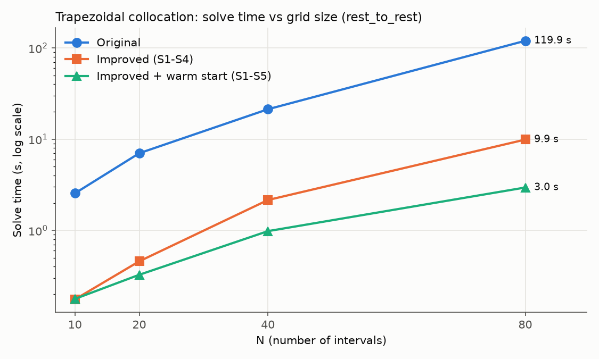
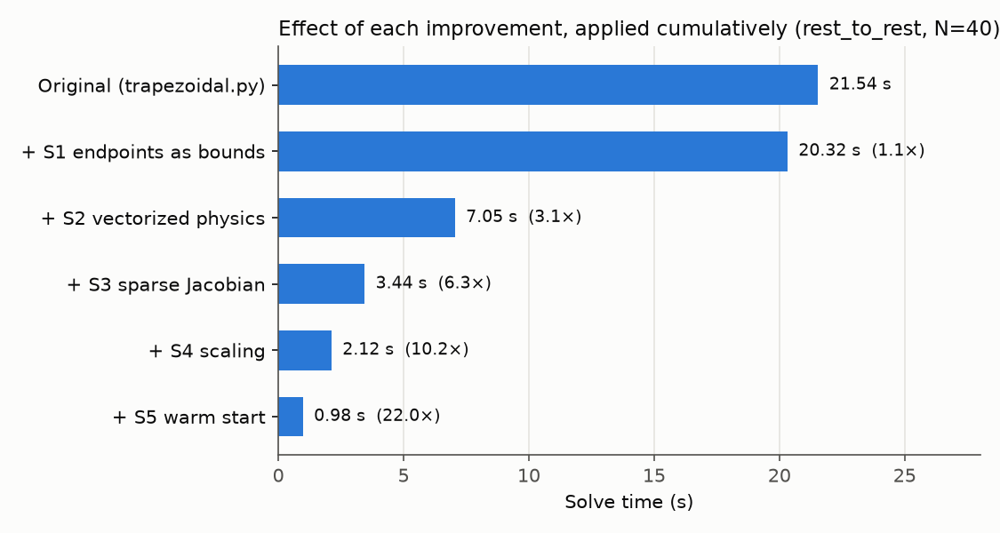

# Original vs Improved Trapezoidal Collocation

Generated by `experiments/compare_trapezoidal.py`.

- **Speedup** = original time / this time (same N, same scenario).
- **Cost diff vs original** = |cost − original cost| / original cost. Near 0 means the same answer.
- **Max violation** = worst start/end/defect error (same definition for both solvers).
- **Final drift** = end-effector miss distance when the torques are replayed in a
  high-accuracy simulation (the benchmark's reality check).
- Times are the median of 3 run(s); the original solver at N ≥ 80 was timed once.
- Warm-start times **include** the coarse-grid solves; its iterations are the total over all levels.

## 1. Speed vs grid size (rest_to_rest)

| N | Solver | OK | Time | Speedup | Iterations | Cost | Cost diff vs original | Max violation | Final drift |
|---|---|---|---|---|---|---|---|---|---|
| 10 | Original | ✅ | 2.55 s | 1.0× | 46 | 243.108 | — | 5.7e-08 | 0.9966 m |
| 10 | Improved (S1-S4) | ✅ | 0.18 s | **14.6×** | 36 | 243.108 | 1.1e-09 | 7.7e-10 | 0.9967 m |
| 10 | Improved + warm start (S1-S5) | ✅ | 0.18 s | **14.4×** | 36 | 243.108 | 1.1e-09 | 7.7e-10 | 0.9967 m |
| 20 | Original | ✅ | 7.01 s | 1.0× | 44 | 223.472 | — | 7.6e-10 | 0.0712 m |
| 20 | Improved (S1-S4) | ✅ | 0.46 s | **15.3×** | 44 | 223.472 | 2.3e-09 | 1.8e-10 | 0.0712 m |
| 20 | Improved + warm start (S1-S5) | ✅ | 0.33 s | **21.5×** | 51 | 223.472 | 2.3e-09 | 3.7e-09 | 0.0712 m |
| 40 | Original | ✅ | 21.30 s | 1.0× | 46 | 220.164 | — | 1.5e-09 | 0.0094 m |
| 40 | Improved (S1-S4) | ✅ | 2.15 s | **9.9×** | 46 | 220.164 | 1.4e-07 | 5.0e-10 | 0.0094 m |
| 40 | Improved + warm start (S1-S5) | ✅ | 0.98 s | **21.7×** | 65 | 220.164 | 1.4e-07 | 1.2e-11 | 0.0094 m |
| 80 | Original | ✅ | 119.87 s | 1.0× | 61 | 219.318 | — | 7.9e-10 | 0.0017 m |
| 80 | Improved (S1-S4) | ✅ | 9.90 s | **12.1×** | 44 | 219.318 | 5.2e-09 | 2.2e-09 | 0.0017 m |
| 80 | Improved + warm start (S1-S5) | ✅ | 2.95 s | **40.6×** | 74 | 219.318 | 4.6e-09 | 6.9e-10 | 0.0017 m |

## 2. Ablation: each improvement's contribution (rest_to_rest, N=40)

Each row adds one improvement on top of the row above it.

| Solver | OK | Time | Speedup | Iterations | Cost | Cost diff vs original | Max violation | Final drift |
|---|---|---|---|---|---|---|---|---|
| Original (trapezoidal.py) | ✅ | 21.54 s | 1.0× | 46 | 220.164 | — | 1.5e-09 | 0.0094 m |
| + S1 endpoints as bounds | ✅ | 20.32 s | **1.1×** | 46 | 220.164 | 3.9e-10 | 1.5e-09 | 0.0094 m |
| + S2 vectorized physics | ✅ | 7.05 s | **3.1×** | 46 | 220.164 | 8.2e-11 | 1.3e-09 | 0.0094 m |
| + S3 sparse Jacobian | ✅ | 3.44 s | **6.3×** | 46 | 220.164 | 1.5e-10 | 1.4e-09 | 0.0094 m |
| + S4 scaling | ✅ | 2.12 s | **10.2×** | 46 | 220.164 | 1.4e-07 | 5.0e-10 | 0.0094 m |
| + S5 warm start | ✅ | 0.98 s | **22.0×** | 65 | 220.164 | 1.4e-07 | 1.2e-11 | 0.0094 m |

## 3. All scenarios (N=30)

### rest_to_rest

| Solver | OK | Time | Speedup | Iterations | Cost | Cost diff vs original | Max violation | Final drift |
|---|---|---|---|---|---|---|---|---|
| Original | ✅ | 14.53 s | 1.0× | 51 | 221.011 | — | 2.5e-09 | 0.0203 m |
| Improved (S1-S4) | ✅ | 1.02 s | **14.2×** | 44 | 221.011 | 1.5e-09 | 1.6e-09 | 0.0203 m |
| Improved + warm start (S1-S5) | ✅ | 0.61 s | **23.8×** | 54 | 221.011 | 1.6e-09 | 1.4e-10 | 0.0203 m |

### obstacle

| Solver | OK | Time | Speedup | Iterations | Cost | Cost diff vs original | Max violation | Final drift |
|---|---|---|---|---|---|---|---|---|
| Original | ✅ | 28.78 s | 1.0× | 79 | 335.268 | — | 3.3e-10 | 0.1887 m |
| Improved (S1-S4) | ✅ | 5.39 s | **5.3×** | 156 | 294.606 | 1.2e-01 | 1.3e-09 | 0.1477 m |
| Improved + warm start (S1-S5) | ✅ | 3.74 s | **7.7×** | 242 | 239.240 | 2.9e-01 | 1.2e-10 | 0.2398 m |

### high_speed

| Solver | OK | Time | Speedup | Iterations | Cost | Cost diff vs original | Max violation | Final drift |
|---|---|---|---|---|---|---|---|---|
| Original | ✅ | 34.63 s | 1.0× | 120 | 1212.075 | — | 1.3e-10 | 0.0022 m |
| Improved (S1-S4) | ✅ | 1.67 s | **20.7×** | 58 | 1212.075 | 4.3e-09 | 8.9e-11 | 0.0022 m |
| Improved + warm start (S1-S5) | ✅ | 0.81 s | **42.9×** | 77 | 1212.075 | 4.3e-09 | 5.0e-10 | 0.0022 m |

### under_torqued

| Solver | OK | Time | Speedup | Iterations | Cost | Cost diff vs original | Max violation | Final drift |
|---|---|---|---|---|---|---|---|---|
| Original | ✅ | 12.73 s | 1.0× | 44 | 115.393 | — | 3.2e-09 | 0.9022 m |
| Improved (S1-S4) | ✅ | 1.09 s | **11.7×** | 32 | 115.393 | 1.2e-08 | 9.1e-10 | 0.9022 m |
| Improved + warm start (S1-S5) | ✅ | 0.42 s | **30.3×** | 31 | 115.393 | 1.2e-08 | 6.3e-09 | 0.9022 m |

### reversal

| Solver | OK | Time | Speedup | Iterations | Cost | Cost diff vs original | Max violation | Final drift |
|---|---|---|---|---|---|---|---|---|
| Original | ✅ | 93.54 s | 1.0× | 320 | 566.318 | — | 2.3e-10 | 0.2615 m |
| Improved (S1-S4) | ✅ | 0.63 s | **147.6×** | 23 | 1019.809 | 8.0e-01 | 3.5e-10 | 0.0679 m |
| Improved + warm start (S1-S5) | ✅ | 1.66 s | **56.4×** | 201 | 566.318 | 1.6e-09 | 2.1e-10 | 0.5278 m |

### swing_up

| Solver | OK | Time | Speedup | Iterations | Cost | Cost diff vs original | Max violation | Final drift |
|---|---|---|---|---|---|---|---|---|
| Original | ✅ | 19.23 s | 1.0× | 67 | 60.608 | — | 3.0e-09 | 2.6763 m |
| Improved (S1-S4) | ✅ | 1.74 s | **11.1×** | 54 | 60.608 | 7.6e-09 | 9.8e-10 | 2.6765 m |
| Improved + warm start (S1-S5) | ✅ | 0.83 s | **23.1×** | 70 | 60.608 | 7.5e-09 | 8.1e-09 | 2.6764 m |

